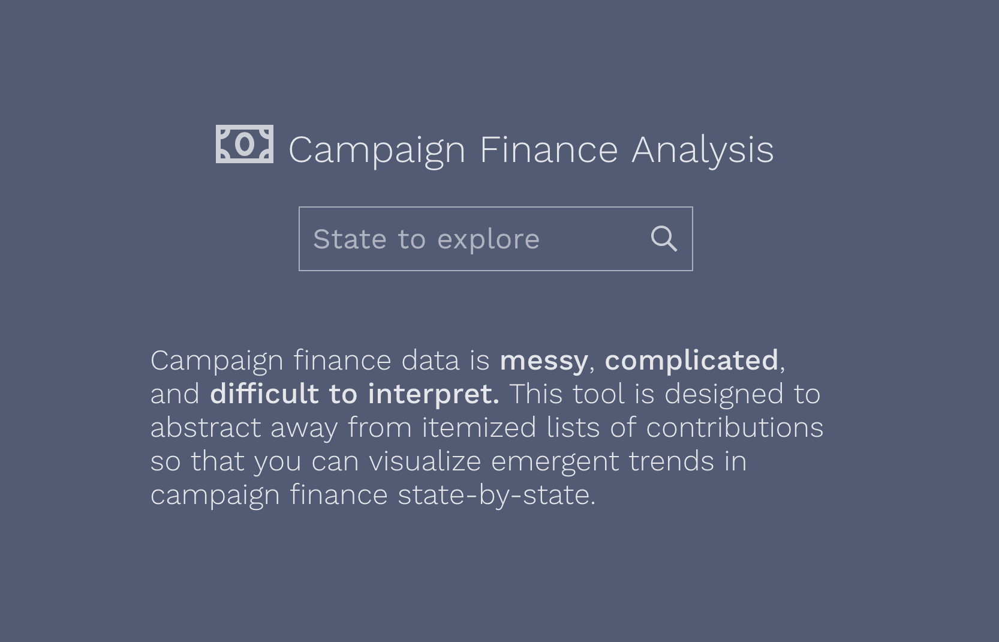
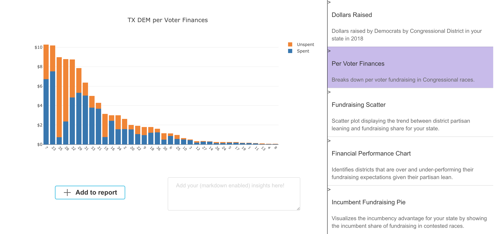
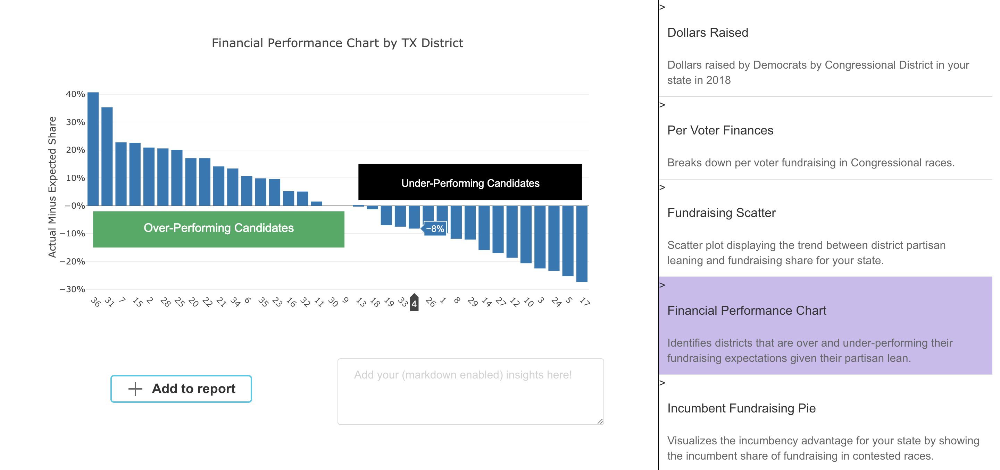
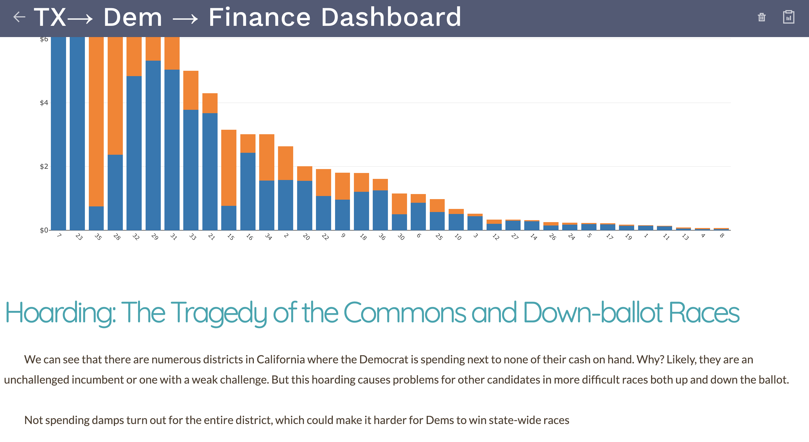

# Campaign Finance Explorer

This is a proof of concept campaign finance explorer and report generation tool I made as a project in collaboration with Harvard's Shorenstein Center on Media, Politics and Public Policy.

The goal is to both show how campaign finance misallocation can impact state-wide races and also visualize the impact that the intersection of industry contribution and the incumbency advantage in fundraising has on corporate influence in politics. 

This is the splash page where you can select which state you want to explore the finances of. 

When you select a state, you are prompted to choose a party. 

From there, you can visualize a variety of different campaign finance trends. 

For instance,

or

Finally, you can synthesize all of these insights into a markdown enabled report!

